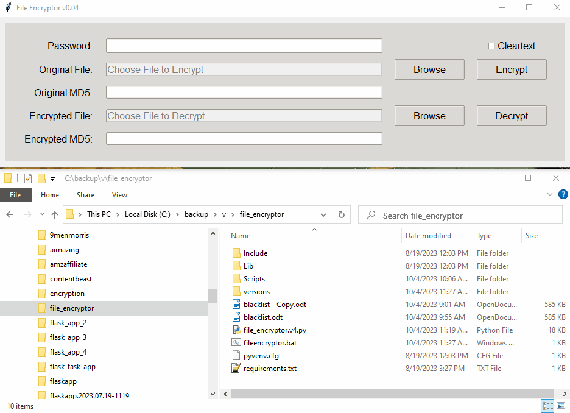

# File Encryptor Tool

File Encryptor Tool is a Python-based graphical user interface (GUI) application that allows users to securely encrypt and decrypt files using the Fernet symmetric encryption scheme.


## Features

- **Secure Encryption:** Uses Fernet (AES-128 in CBC mode) for robust symmetric encryption.
- **Strong Password Policy:** Enforces a minimum of 14 characters, including uppercase, lowercase, digits, and symbols.
- **Integrity Verification:** Uses MD5 hashing to ensure decrypted files match the original source.
- **GUI Interface:** Simple and intuitive interface built with `tkinter` for easy file selection and processing.
- **Metadata Protection:** Encrypts both the file content and the original filename.
- **Cleartext Option:** Provides an optional mode to save files in cleartext Base64 format (use with caution).

## Demo



## How to Use

1. **Launch the Application:** Run `main.py` or use the `start.bat` file.
2. **Set a Password:** Enter a strong password (min 14 chars, mixed case, digits, and symbols).
3. **Encrypt a File:**
    - Click **Browse** next to "Original File" to select a file.
    - Click **Encrypt**.
    - An `encrypted_YYYYMMDD_HHMMSS.json` file will be created in the application directory.
4. **Decrypt a File:**
    - Click **Browse** next to "Encrypted File" to select an encrypted JSON file.
    - Enter the password used during encryption.
    - Click **Decrypt**.
    - The original file will be restored in the current directory, and MD5 integrity will be verified.

| Action | Description |
|--------|-------------|
| **Browse** | Opens a file dialog to select files. |
| **Encrypt** | Starts the encryption process. |
| **Decrypt** | Starts the decryption process. |
| **Cleartext Checkbox** | If checked, saves a Base64 version in cleartext alongside the encrypted one. |

## Known Issues & Security

- **Lack of Salting:** The current implementation derives the encryption key directly from the SHA-256 hash of the password without a unique salt.
- **Symmetric Nature:** Recovery is impossible without the original password.
- **MD5 Usage:** MD5 is used for integrity checks; while sufficient for basic verification, SHA-256 is recommended for future updates.
- **Metadata Visibility:** The structure of the output JSON reveals it is an encrypted file, though its contents remain secure.

## Dependencies

| Module | Purpose |
|--------|---------|
| `cryptography` | Core encryption logic (Fernet). |
| `tkinter` | Graphical User Interface. |
| `base64` | Encoding file data for compatibility. |
| `hashlib` | SHA-256 key derivation and MD5 integrity checks. |
| `json` | Storing encrypted data and metadata. |

## Privacy

This application is entirely local. It does not collect, store, or transmit any telemetry, passwords, or file data to external servers.

## Installation

Follow these steps to set up the project and its virtual environment.

### 1. Python Requirement

- **Windows:** [Download Python 3.13.1](https://www.python.org/ftp/python/3.13.1/python-3.13.1-amd64.exe)
- **macOS:** [Download Python 3.13.1](https://www.python.org/ftp/python/3.13.1/python-3.13.1-macos11.pkg) or use `brew install python@3.13`.
- **Linux:** `sudo apt install python3.13`

### 2. Clone the Repository
```bash
git clone https://github.com/rubysash/file-encryptor.git
cd file-encryptor
```

### 3. Create the Virtual Environment

#### Windows
```bash
python -m venv file-encryptor
cd file-encryptor
Scripts\activate
python -m pip install pip --upgrade pip
pip install -r requirements.txt
```

#### Linux
```bash
python3 -m venv file-encryptor
cd file-encryptor
source bin/activate
python3 -m pip install pip --upgrade pip
python3 -m pip install -r requirements.txt
```

### 4. Running the Application

#### Windows
```bash
python main.py
```
Or use the provided `start.bat`.

#### Linux
```bash
python3 main.py
```

## Shortcuts

You can create a Windows shortcut to the `start.bat` file or use the following command in a custom shortcut to run the tool instantly:
```cmd
start cmd /c "Scripts\activate && python main.py"
```

## Future Plans

- **Implement Salting:** Transition to a key derivation function like Argon2 or Scrypt with unique salts.
- **Enhanced Hashing:** Move from MD5 to SHA-256 for file integrity verification.
- **Batch Processing:** Add the ability to encrypt/decrypt multiple files or entire directories at once.

## Troubleshooting

- **Invalid Token Error:** This usually occurs when the wrong password is provided during decryption.
- **Missing Dependencies:** Ensure you have activated the virtual environment and run `pip install -r requirements.txt`.
- **GUI Scaling:** If the GUI appears too small, check your OS high-DPI settings.
